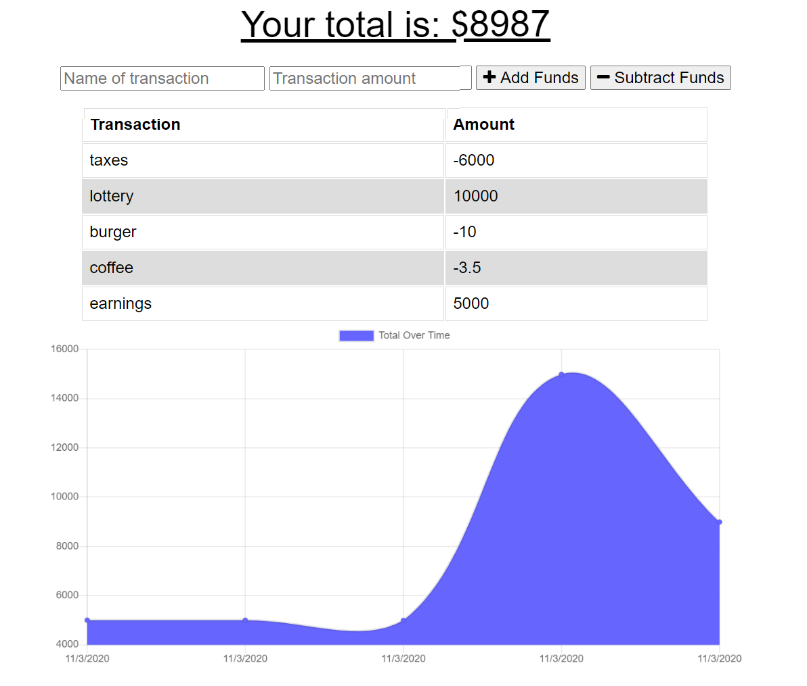

# offline-budget

## Description
This application is a PWA using MongoDB that allows for tracking of simple debits and credits in your budget.
## Table of Contents
* [Installation](#installation)
* [Usage](#usage)
* [License](#license)
* [Contributing](#Contributing)
* [Tests](#Tests)
* [Questions](#Questions)
## Installation
The package JSON is included, so run npm install to have the necessary node packages for further development.
## Usage 
Navigate to the [website]() and fill out the relevant details of your transaction. Install on your homepage for easy access.

## License 

Copyright 2020 Caitlin Bouroncle
        
Permission is hereby granted, free of charge, to any person obtaining a copy of this software and associated documentation files (the "Software"), to deal in the Software without restriction, including without limitation the rights to use, copy, modify, merge, publish, distribute, sublicense, and/or sell copies of the Software, and to permit persons to whom the Software is furnished to do so, subject to the following conditions:
        
The above copyright notice and this permission notice shall be included in all copies or substantial portions of the Software.
        
THE SOFTWARE IS PROVIDED "AS IS", WITHOUT WARRANTY OF ANY KIND, EXPRESS OR IMPLIED, INCLUDING BUT NOT LIMITED TO THE WARRANTIES OF MERCHANTABILITY, FITNESS FOR A PARTICULAR PURPOSE AND NONINFRINGEMENT. IN NO EVENT SHALL THE AUTHORS OR COPYRIGHT HOLDERS BE LIABLE FOR ANY CLAIM, DAMAGES OR OTHER LIABILITY, WHETHER IN AN ACTION OF CONTRACT, TORT OR OTHERWISE, ARISING FROM, OUT OF OR IN CONNECTION WITH THE SOFTWARE OR THE USE OR OTHER DEALINGS IN THE SOFTWARE.

## Contributing
Please reach out to discuss any ideas you wish to contribute.
## Tests
There are no tests at this time.
## Questions
For any questions please find me on GitHub or email me: 

[gitHub profile](https://github.com/caitlinbou)

[email contact](mailto:caitlin.bouroncle@gmail.com)

